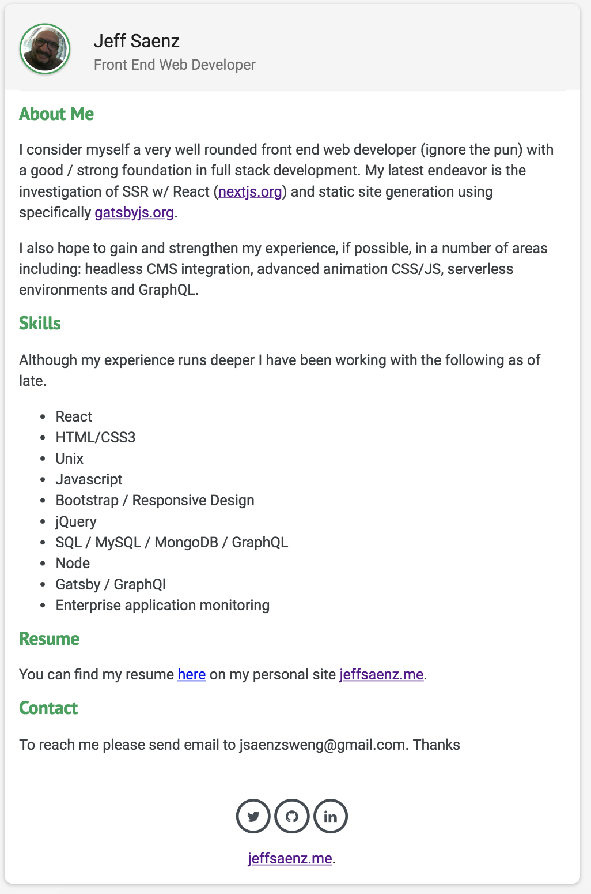

# jeffsaenz-profilepage

A responsive vanilla html/css bio page for yours truly. This is part of my portfolio. 
It's currently hosted [on surge](http://jeffsaenz.surge.sh/).

## Features

* [normalize.css](https://necolas.github.io/normalize.css/) HTML5 alternative to CSS resets
* [Google PT Sans Web Font](https://fonts.google.com/specimen/PT+Sans)
* [Font Awesome](https://fontawesome.com/) Icons for social buttons
* [Bootstrap 4](https://getbootstrap.com/) Modular component framework
* [jQuery](https://jquery.com/) Document traversal and manipulation, event handling, animation, and Ajax.
* [AWS Lambda](https://aws.amazon.com/lambda/) Backend cloud function for email notification using SNS.

## Screen Shot

